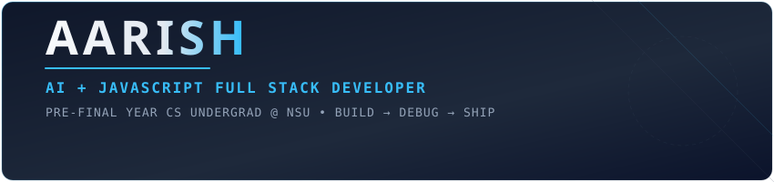
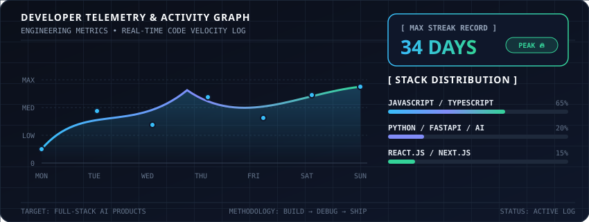

<div align="center">

  <!-- Sober & Creative Header Banner -->
  

  <br/><br/>

  <!-- Dynamic Typing Subtitle in Sober Cyan/Slate Monospace -->
  <a href="https://git.io/typing-svg">
    
  </a>

</div>

<br/>

```
================================================================================
  PROFILE OVERVIEW // AARISH
================================================================================
  ROLE        : AI + JavaScript Full Stack Developer
  STATUS      : Pre-Final Year CS Undergrad @ Netaji Subhas University (NSU)
  METHODOLOGY : BUILD → DEBUG → SHIP
  STACK       : JavaScript, TypeScript, React, Next.js, Node.js, Python, FastAPI
================================================================================
```

---

### 📊 DEVELOPER TELEMETRY & MAX STREAK

<div align="center">
  <!-- Handcrafted Precision Telemetry Graph -->
  
</div>

<br/>

<div align="center">
  <!-- GitHub Overall Stats -->
  
  &nbsp;
  <!-- Top Languages Compact -->
  
</div>

---

### 🛠️ CORE STACK ARCHITECTURE

| Domain | Engineering Tools & Frameworks |
| :--- | :--- |
| **Frontend** | `JavaScript (ES6+)` `TypeScript` `React.js` `Next.js` `Tailwind CSS` `HTML5/CSS3` |
| **Backend & AI** | `Node.js` `Express.js` `Python` `FastAPI` `RESTful APIs` |
| **Database & Tools** | `MongoDB` `MySQL` `Git` `GitHub` `VS Code` `Postman` |

---

### 📬 CONNECT TERMINAL

```
> LINKEDIN  : https://www.linkedin.com/in/aarishali949
> EMAIL     : aliaarish949@gmail.com
> GITHUB    : https://github.com/aliaarish17
```

<br/>

<div align="center">
  <sub><code>⚡ MAINTAINED WITH PRECISION BY AARISH</code></sub>
</div>
